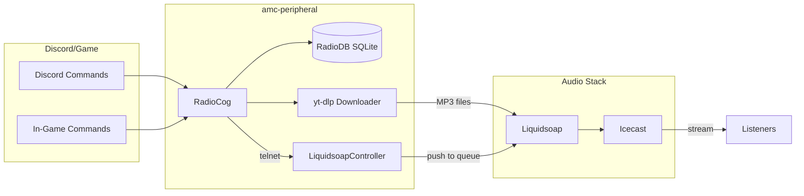
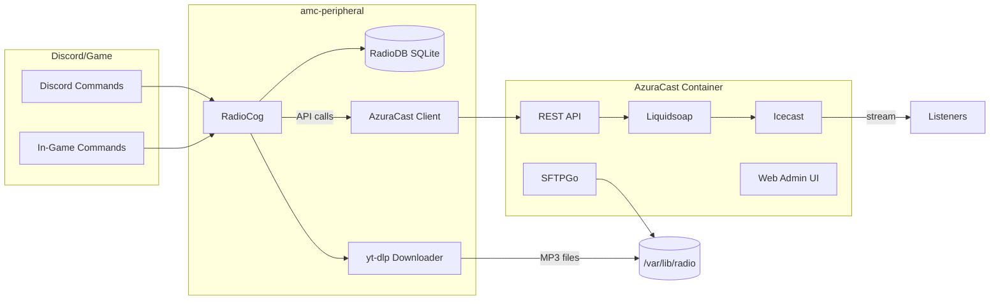
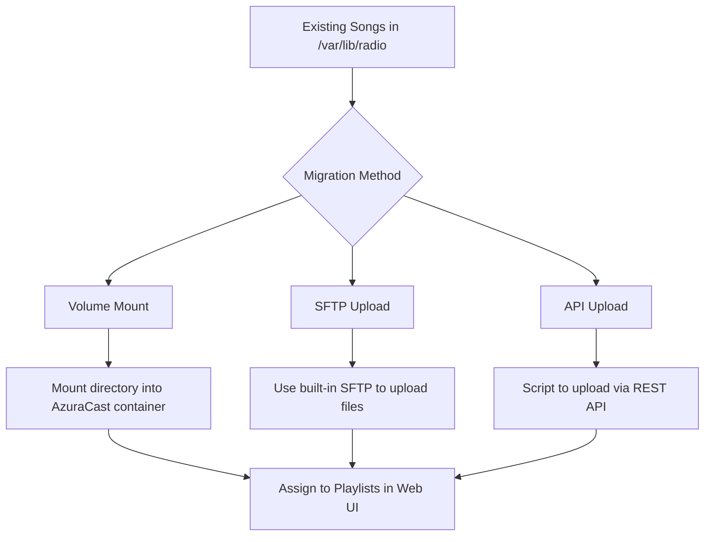

# AzuraCast Migration Plan

This document outlines the detailed migration plan for transitioning from the current custom Liquidsoap + Icecast radio system to AzuraCast while preserving all existing features.

## Background

The current radio system consists of:
- **Liquidsoap** for audio routing, playlists, and request queues
- **Icecast** for streaming (MP3 128kbps + Opus)
- **Discord bot** (`RadioCog`) for song requests, likes/dislikes, AI jingles
- **In-game integration** for Motor Town song requests and likes
- **SQLite database** (`RadioDB`) for persistence
- **Custom modes**: `race_mode`, `event_mode` with different audio routing

## User Review Required

> [!IMPORTANT]
> **Deployment Choice**: AzuraCast can be deployed via Podman (see deployment options below). Database can remain on NixOS-managed PostgreSQL if desired.

> [!WARNING]
> **Breaking Change**: During migration, there will be a brief period where the radio stream URL may change. Existing players and in-game radio will need updating.

> [!CAUTION]
> **Data Migration**: Your existing song request history, likes/dislikes in SQLite will need to be preserved separately since AzuraCast has its own database schema.

---

## Decisions Made

Based on your feedback:

| Question | Decision |
|----------|----------|
| Race/Event Modes | **(b) Single station with scheduled playlists** |
| Stream URLs | New paths acceptable |
| AI Jingles/News | Continue writing to `/var/lib/radio`, mounted into AzuraCast |

---

## Architecture Comparison

### Current Architecture



### Target Architecture with AzuraCast



---

## Deployment Options

### Option 1: Podman (Recommended for NixOS)

AzuraCast supports Podman via its utility script with `PODMAN_MODE=1`. This integrates better with NixOS than Docker.

#### [NEW] [azuracast.nix](file:///Users/freemanlatif/amc-server/amc-peripheral/radio/azuracast.nix)

```nix
{ config, lib, pkgs, ... }: let
  cfg = config.services.azuracast;
in {
  options.services.azuracast = {
    enable = lib.mkEnableOption "AzuraCast radio automation";
    dataDir = lib.mkOption {
      type = lib.types.str;
      default = "/var/azuracast";
    };
    mediaMount = lib.mkOption {
      type = lib.types.str;
      default = "/var/lib/radio";
      description = "Host path to mount as media directory";
    };
  };

  config = lib.mkIf cfg.enable {
    # Use Podman instead of Docker
    virtualisation.podman = {
      enable = true;
      dockerCompat = true;  # Provides 'docker' command alias
      defaultNetwork.settings.dns_enabled = true;
    };
    
    # Install podman-compose
    environment.systemPackages = [ pkgs.podman-compose ];
    
    # AzuraCast data directory
    systemd.tmpfiles.rules = [
      "d ${cfg.dataDir} 0755 root root -"
    ];
    
    # Fetch and configure AzuraCast
    systemd.services.azuracast-setup = {
      description = "AzuraCast Initial Setup";
      wantedBy = [ "multi-user.target" ];
      after = [ "network-online.target" ];
      serviceConfig = {
        Type = "oneshot";
        RemainAfterExit = true;
        Environment = "PODMAN_MODE=1";
        WorkingDirectory = cfg.dataDir;
        ExecStart = pkgs.writeShellScript "azuracast-setup" ''
          if [ ! -f docker-compose.yml ]; then
            ${pkgs.curl}/bin/curl -fsSL https://raw.githubusercontent.com/AzuraCast/AzuraCast/main/docker.sh > docker.sh
            chmod +x docker.sh
            PODMAN_MODE=1 ./docker.sh install
          fi
        '';
      };
    };
    
    # Run AzuraCast
    systemd.services.azuracast = {
      description = "AzuraCast Radio Automation";
      after = [ "azuracast-setup.service" "podman.service" ];
      wantedBy = [ "multi-user.target" ];
      environment = {
        PODMAN_MODE = "1";
      };
      serviceConfig = {
        Type = "oneshot";
        RemainAfterExit = true;
        WorkingDirectory = cfg.dataDir;
        ExecStart = "${pkgs.podman-compose}/bin/podman-compose up -d";
        ExecStop = "${pkgs.podman-compose}/bin/podman-compose down";
      };
    };
    
    networking.firewall.allowedTCPPorts = [ 80 443 8000 8010 2022 ];
  };
}
```

### Option 2: Hybrid - NixOS Database + Podman AzuraCast

For better database management, you can run MariaDB/PostgreSQL natively on NixOS and point AzuraCast to it:

```nix
# In your NixOS configuration
services.mysql = {
  enable = true;
  package = pkgs.mariadb;
  initialDatabases = [{ name = "azuracast"; }];
  ensureUsers = [{
    name = "azuracast";
    ensurePermissions = { "azuracast.*" = "ALL PRIVILEGES"; };
  }];
};

# Then in azuracast.env:
# MYSQL_HOST=host.containers.internal
# MYSQL_DATABASE=azuracast
# MYSQL_USER=azuracast
# MYSQL_PASSWORD=<secure password>
```

**Benefits of hybrid approach:**
- Native NixOS backups for database
- Better integration with existing infrastructure
- Database persists independently of container lifecycle

### Option 3: Full Native (Not Recommended)

AzuraCast bundles many components (web server, database, cache, liquidsoap, icecast). Running these natively would require:
- Nginx/Apache
- MariaDB
- Redis
- Supervisor
- PHP-FPM
- Liquidsoap
- Icecast

This is complex and would lose the benefits of AzuraCast's integrated management. **Not recommended** unless you have specific requirements.

---

## Migrating Existing Songs

Your existing songs are in `/var/lib/radio/` subdirectories. Here's how to migrate them:

### Migration Strategy



### Method 1: Volume Mount (Recommended)

Mount your existing media directly into AzuraCast. Files are immediately available without copying.

Add to `docker-compose.override.yml` (or Podman equivalent):

```yaml
services:
  web:
    volumes:
      # Mount existing songs
      - /var/lib/radio/prev_requests:/var/azuracast/stations/amc_radio/media/prev_requests:ro
      - /var/lib/radio/songs:/var/azuracast/stations/amc_radio/media/songs:ro
      - /var/lib/radio/race_songs:/var/azuracast/stations/amc_radio/media/race_songs:ro
      - /var/lib/radio/event_songs:/var/azuracast/stations/amc_radio/media/event_songs:ro
      - /var/lib/radio/jingles:/var/azuracast/stations/amc_radio/media/jingles:ro
      # Mount for new requests (read-write)
      - /var/lib/radio/requests:/var/azuracast/stations/amc_radio/media/requests:rw
```

After mounting, in AzuraCast web UI:
1. Go to **Media > Music Files**
2. Select each folder (prev_requests, songs, etc.)
3. Click **Bulk Actions > Add to Playlist**
4. Assign to appropriate playlists (General, Race, Event, Jingles)

### Method 2: SFTP Bulk Upload

If you prefer to copy files into AzuraCast's managed storage:

1. **Create SFTP user** in AzuraCast: `Media > SFTP Users`
2. **Connect via SFTP**:
   ```bash
   sftp -P 2022 azuracast@your-server
   ```
3. **Upload files**:
   ```bash
   put -r /var/lib/radio/prev_requests/* .
   put -r /var/lib/radio/songs/* .
   ```
4. **Assign to playlists** in the web UI

### Method 3: API Script (For Automation)

Create a migration script to upload and assign files:

```python
#!/usr/bin/env python3
"""Migrate existing songs to AzuraCast."""

import os
import asyncio
import aiohttp
from pathlib import Path

AZURACAST_URL = "http://localhost"
API_KEY = "your-api-key"
STATION_ID = 1

async def upload_and_assign(session: aiohttp.ClientSession, file_path: str, playlist_name: str):
    """Upload a file and assign to playlist."""
    headers = {"X-API-Key": API_KEY}
    
    # Upload
    url = f"{AZURACAST_URL}/api/station/{STATION_ID}/files"
    form = aiohttp.FormData()
    form.add_field("path", f"migrated/{Path(file_path).name}")
    form.add_field("file", open(file_path, "rb"), 
                   filename=Path(file_path).name,
                   content_type="audio/mpeg")
    
    async with session.post(url, headers=headers, data=form) as resp:
        if resp.status in (200, 201):
            result = await resp.json()
            print(f"Uploaded: {file_path}")
            return result.get("id")
        else:
            print(f"Failed: {file_path} - {resp.status}")
            return None

async def migrate_directory(source_dir: str, playlist_name: str):
    """Migrate all files in a directory."""
    async with aiohttp.ClientSession() as session:
        for file in Path(source_dir).glob("*.mp3"):
            await upload_and_assign(session, str(file), playlist_name)

async def main():
    # Migrate each directory to appropriate playlist
    migrations = [
        ("/var/lib/radio/prev_requests", "General Rotation"),
        ("/var/lib/radio/songs", "General Rotation"),
        ("/var/lib/radio/race_songs", "Race Mode"),
        ("/var/lib/radio/event_songs", "Event Mode"),
        ("/var/lib/radio/jingles", "Jingles"),
    ]
    
    for source_dir, playlist in migrations:
        if os.path.exists(source_dir):
            print(f"Migrating {source_dir} -> {playlist}")
            await migrate_directory(source_dir, playlist)

if __name__ == "__main__":
    asyncio.run(main())
```

### CSV Metadata Import

After uploading, you can bulk-edit metadata using AzuraCast's CSV tool:

1. Go to **Reports > Bulk Media CSV Import/Export**
2. **Export** current media to CSV
3. Edit in spreadsheet (add metadata, correct titles, set cue points)
4. **Import** the modified CSV

---

## AI Jingles/News - Better Integration

Instead of just mounting the jingles directory, you can integrate more tightly with AzuraCast:

### Option A: Upload via API After Generation (Recommended)

Modify `RadioCog.generate_jingles_gen` to upload directly to AzuraCast:

```python
async def generate_jingles_gen(self):
    """Generate jingles and upload to AzuraCast."""
    # ... existing jingle generation code ...
    
    # After generating the audio file:
    jingle_path = f"/var/lib/radio/jingles/{jingle_filename}"
    
    # Upload to AzuraCast
    await self.azuracast.upload_file(
        self.bot.http_session,
        jingle_path,
        target_path="jingles",
    )
    
    # Optionally add to jingles playlist
    # (AzuraCast can auto-add based on folder)
```

### Option B: Folder Auto-Sync

Configure AzuraCast to automatically scan the mounted jingles folder:

1. Mount `/var/lib/radio/jingles` to `/var/azuracast/stations/.../media/jingles`
2. In AzuraCast, assign the `jingles` folder to a playlist
3. Enable **"Auto-assign to playlist when added to folder"** in playlist settings

New jingles generated by the bot will automatically be included in rotation.

### Option C: Use AzuraCast's Built-in Podcast Feature

For news/gazette content, consider AzuraCast's podcast feature:
- AI-generated news becomes podcast episodes
- Automatic RSS feed generation
- Can still be streamed live or on-demand

---

## Key Technical Decisions

### How Song Requests Will Work

There are **two viable approaches** for handling external song requests in AzuraCast:

#### Option A: AzuraCast API (Recommended)

**Flow:**
1. User requests song via Discord/in-game
2. `RadioCog` downloads audio using yt-dlp to mounted media directory
3. Call AzuraCast API to upload/register the file: `POST /api/station/{id}/files`
4. Call AzuraCast API to queue the file: `PUT /api/station/{id}/files/batch` with `"do": "queue"`
5. Song plays after current track finishes

**Pros:**
- Uses official API, future-proof
- AzuraCast handles queue management
- Web UI shows queue status

**Cons:**
- Requires API calls after each download
- Slight latency between download and queue

#### Option B: Custom Liquidsoap Config (Advanced)

AzuraCast allows editing the station's Liquidsoap configuration. You can add a custom request queue similar to your current setup:

```liquidsoap
# Custom request queue (accessible via harbor HTTP)
custom_requests = request.queue(id="custom_requests")

# Register HTTP endpoint for pushing requests
def push_request(req)
  uri = req.query["uri"]
  if uri != "" then
    custom_requests.push(request.create(uri))
    http.response(data="OK")
  else
    http.response(code=400, data="Missing uri parameter")
  end
end
harbor.http.register.simple(port=6001, "/push", push_request)
```

**Pros:**
- Minimal latency - direct queue push like current system
- Familiar telnet-like interface

**Cons:**
- Custom Liquidsoap configs may break on AzuraCast updates
- Less visibility in web UI
- Requires understanding AzuraCast's Liquidsoap structure

### Recommendation

**Use Option A (API approach)** for the initial migration. It's more maintainable and leverages AzuraCast's built-in features. You can always add Option B later if latency becomes an issue.

---

### Race/Event Modes via Scheduled Playlists

Since you chose **(b) Single station with scheduled playlists**, here's how to implement:

1. **Create Playlists in AzuraCast:**
   - `General Rotation` - Default music
   - `Race Mode` - High-energy race music
   - `Event Mode` - Event-specific tracks
   - `Jingles` - Station jingles

2. **Configure Playlist Scheduling:**
   - In AzuraCast, each playlist can have a **schedule**
   - Use **API to enable/disable playlists** based on mode:

```python
async def set_race_mode(self, enabled: bool):
    """Enable or disable race mode playlist."""
    # Disable general playlist, enable race playlist
    await self.azuracast.set_playlist_enabled(
        self.bot.http_session,
        playlist_name="General Rotation",
        enabled=not enabled,
    )
    await self.azuracast.set_playlist_enabled(
        self.bot.http_session,
        playlist_name="Race Mode",
        enabled=enabled,
    )
```

3. **Add to AzuraCastClient:**

```python
async def set_playlist_enabled(
    self,
    session: aiohttp.ClientSession,
    playlist_id: int,
    enabled: bool,
) -> bool:
    """Enable or disable a playlist."""
    url = f"{self.base_url}/api/station/{self.station_id}/playlist/{playlist_id}"
    payload = {"is_enabled": enabled}
    
    async with session.put(url, headers=self.headers, json=payload) as resp:
        return resp.status == 200
```

---

## Proposed Changes

### Phase 1: AzuraCast Deployment (NixOS + Podman)

See [Deployment Options](#deployment-options) above.

---

### Phase 2: AzuraCast API Client

#### [NEW] [azuracast_client.py](file:///Users/freemanlatif/amc-server/amc-peripheral/amc_peripheral/radio/azuracast_client.py)

New Python client to interact with AzuraCast API:

```python
"""AzuraCast API Client for song requests and queue management."""

import aiohttp
import logging
from typing import Optional
from pathlib import Path

log = logging.getLogger(__name__)

class AzuraCastClient:
    """Client for AzuraCast REST API."""
    
    def __init__(
        self,
        base_url: str = "http://localhost",
        api_key: str = "",
        station_id: int = 1,
    ):
        self.base_url = base_url.rstrip("/")
        self.api_key = api_key
        self.station_id = station_id
        self.headers = {"X-API-Key": api_key}
    
    async def get_now_playing(self, session: aiohttp.ClientSession) -> Optional[dict]:
        """Get current now playing information."""
        url = f"{self.base_url}/api/nowplaying/{self.station_id}"
        async with session.get(url) as resp:
            if resp.status == 200:
                return await resp.json()
            return None
    
    async def upload_file(
        self,
        session: aiohttp.ClientSession,
        file_path: str,
        target_path: str = "requests",
    ) -> Optional[dict]:
        """Upload a file to the station media library."""
        url = f"{self.base_url}/api/station/{self.station_id}/files"
        
        filename = Path(file_path).name
        form = aiohttp.FormData()
        form.add_field("path", f"{target_path}/{filename}")
        form.add_field("file", open(file_path, "rb"), 
                       filename=filename, 
                       content_type="audio/mpeg")
        
        async with session.post(url, headers=self.headers, data=form) as resp:
            if resp.status in (200, 201):
                return await resp.json()
            log.error(f"Upload failed: {resp.status} - {await resp.text()}")
            return None
    
    async def queue_file(
        self,
        session: aiohttp.ClientSession,
        file_path: str,
    ) -> bool:
        """Add a file to the station queue."""
        url = f"{self.base_url}/api/station/{self.station_id}/files/batch"
        payload = {
            "do": "queue",
            "files": [file_path],
        }
        
        async with session.put(url, headers=self.headers, json=payload) as resp:
            if resp.status == 200:
                return True
            log.error(f"Queue failed: {resp.status} - {await resp.text()}")
            return False
    
    async def request_song(
        self,
        session: aiohttp.ClientSession,
        local_file_path: str,
    ) -> bool:
        """Upload and queue a song in one operation."""
        # Upload the file
        result = await self.upload_file(session, local_file_path)
        if not result:
            return False
        
        # Queue it
        azuracast_path = result.get("path", "")
        if azuracast_path:
            return await self.queue_file(session, azuracast_path)
        return False
    
    async def get_queue(self, session: aiohttp.ClientSession) -> list:
        """Get the current station queue."""
        url = f"{self.base_url}/api/station/{self.station_id}/queue"
        async with session.get(url, headers=self.headers) as resp:
            if resp.status == 200:
                return await resp.json()
            return []
    
    async def skip_song(self, session: aiohttp.ClientSession) -> bool:
        """Skip the current song."""
        url = f"{self.base_url}/api/station/{self.station_id}/backend/skip"
        async with session.post(url, headers=self.headers) as resp:
            return resp.status == 200
    
    async def set_playlist_enabled(
        self,
        session: aiohttp.ClientSession,
        playlist_id: int,
        enabled: bool,
    ) -> bool:
        """Enable or disable a playlist (for race/event modes)."""
        url = f"{self.base_url}/api/station/{self.station_id}/playlist/{playlist_id}"
        payload = {"is_enabled": enabled}
        
        async with session.put(url, headers=self.headers, json=payload) as resp:
            return resp.status == 200
    
    async def get_playlists(self, session: aiohttp.ClientSession) -> list:
        """Get all playlists for the station."""
        url = f"{self.base_url}/api/station/{self.station_id}/playlists"
        async with session.get(url, headers=self.headers) as resp:
            if resp.status == 200:
                return await resp.json()
            return []
```

---

### Phase 3: RadioCog Modifications

#### [MODIFY] [radio_cog.py](file:///Users/freemanlatif/amc-server/amc-peripheral/amc_peripheral/radio/radio_cog.py)

Replace `LiquidsoapController` with `AzuraCastClient`:

```diff
- from amc_peripheral.radio.liquidsoap import LiquidsoapController
+ from amc_peripheral.radio.azuracast_client import AzuraCastClient
+ from amc_peripheral.settings import AZURACAST_API_KEY, AZURACAST_BASE_URL

  class RadioCog(commands.Cog):
      def __init__(self, bot):
          self.bot = bot
-         self.lq = LiquidsoapController()
+         self.azuracast = AzuraCastClient(
+             base_url=AZURACAST_BASE_URL,
+             api_key=AZURACAST_API_KEY,
+         )
```

Modify `request_song` method:

```diff
      # --- Push to Queue ---
      local_path = f"{REQUESTS_PATH}/{base_filename}.mp3"
-     try:
-         await asyncio.to_thread(self.lq.push_to_queue, "song_requests", local_path)
-     except Exception as e:
-         log.error(f"Failed to push song to queue via telnet, but continuing: {e}")
+     try:
+         success = await self.azuracast.request_song(
+             self.bot.http_session,
+             local_path,
+         )
+         if not success:
+             log.error("Failed to queue song in AzuraCast")
+     except Exception as e:
+         log.error(f"Failed to push song to AzuraCast queue: {e}")
```

Modify `skip_radio_track`:

```diff
  async def skip_radio_track(self, interaction: discord.Interaction):
      """Skip the current track on the radio."""
-     await asyncio.to_thread(self.lq.skip_current_track)
+     await self.azuracast.skip_song(self.bot.http_session)
      await interaction.response.send_message("Skipped!", ephemeral=True)
```

Modify race/event mode commands:

```diff
  async def set_race_mode(self, interaction: discord.Interaction, state: bool):
-     await asyncio.to_thread(self.lq._send_command, f"race_mode.set {str(state).lower()}")
+     # Get playlist IDs (cache these on startup)
+     await self.azuracast.set_playlist_enabled(
+         self.bot.http_session,
+         playlist_id=self.race_playlist_id,
+         enabled=state,
+     )
+     await self.azuracast.set_playlist_enabled(
+         self.bot.http_session,
+         playlist_id=self.general_playlist_id,
+         enabled=not state,
+     )
      await interaction.response.send_message(f"Race mode: {state}", ephemeral=True)
```

---

### Phase 4: Now Playing Integration

#### [MODIFY] [radio_server.py](file:///Users/freemanlatif/amc-server/amc-peripheral/amc_peripheral/radio/radio_server.py)

Update to use AzuraCast API instead of custom `/metadata` endpoint:

```diff
- RADIO_SERVER_BASE_URL = "http://localhost:6001"
+ AZURACAST_BASE_URL = os.environ.get("AZURACAST_BASE_URL", "http://localhost")
+ STATION_ID = os.environ.get("AZURACAST_STATION_ID", "1")

  async def get_current_song_metadata(
      http_session: aiohttp.ClientSession,
  ) -> Optional[dict]:
-     try:
-         async with http_session.get(f"{RADIO_SERVER_BASE_URL}/metadata") as resp:
-             return await resp.json()
-     except Exception as e:
-         log.error(f"Could not fetch radio metadata: {e}")
-         return None
+     """Fetch metadata from AzuraCast now playing endpoint."""
+     try:
+         url = f"{AZURACAST_BASE_URL}/api/nowplaying/{STATION_ID}"
+         async with http_session.get(url) as resp:
+             data = await resp.json()
+             now_playing = data.get("now_playing", {})
+             song = now_playing.get("song", {})
+             return {
+                 "title": song.get("title", ""),
+                 "artist": song.get("artist", ""),
+                 "album": song.get("album", ""),
+                 "filename": song.get("path", ""),
+             }
+     except Exception as e:
+         log.error(f"Could not fetch AzuraCast metadata: {e}")
+         return None
```

---

### Phase 5: Settings & Environment

#### [MODIFY] [settings.py](file:///Users/freemanlatif/amc-server/amc-peripheral/amc_peripheral/settings.py)

Add AzuraCast configuration:

```python
# AzuraCast Configuration
AZURACAST_BASE_URL = os.environ.get("AZURACAST_BASE_URL", "http://localhost")
AZURACAST_API_KEY = os.environ.get("AZURACAST_API_KEY", "")
AZURACAST_STATION_ID = int(os.environ.get("AZURACAST_STATION_ID", "1"))
```

---

### Phase 6: Remove Deprecated Components

#### [DELETE] [liquidsoap.nix](file:///Users/freemanlatif/amc-server/amc-peripheral/radio/liquidsoap.nix)

No longer needed - AzuraCast manages its own Liquidsoap.

#### [DELETE] [liquidsoap.py](file:///Users/freemanlatif/amc-server/amc-peripheral/amc_peripheral/radio/liquidsoap.py)

Replaced by `azuracast_client.py`.

---

## Feature Migration Matrix

| Feature | Current Implementation | AzuraCast Implementation | Effort |
|---------|----------------------|-------------------------|--------|
| Song Requests (Discord) | `RadioCog.request_song` → `LiquidsoapController.push_to_queue` | `RadioCog.request_song` → `AzuraCastClient.request_song` | Low |
| Song Requests (In-Game) | `RadioCog.game_request_song` | Same flow, uses `AzuraCastClient` | Low |
| Likes/Dislikes | `RadioDB` SQLite | **Keep as-is** - separate from AzuraCast | None |
| Now Playing | Custom `/metadata` HTTP endpoint | AzuraCast `/api/nowplaying/{id}` | Low |
| Skip Track | `LiquidsoapController.skip_current_track` | `AzuraCastClient.skip_song` | Low |
| Race Mode | Liquidsoap `race_mode` interactive var | Enable/disable playlists via API | Low |
| Event Mode | Liquidsoap `event_mode` interactive var | Enable/disable playlists via API | Low |
| AI Jingles | `RadioCog.generate_jingles_gen` → TTS → `/var/lib/radio/jingles` | Upload via API after generation | Low |
| AI News/Gazette | `RadioCog.generate_news_content` | **Keep as-is** or use podcast feature | None |
| Live RTMP | `input.rtmp` in Liquidsoap | AzuraCast native DJ connection | Low |
| Crossfade/Intros | Custom Liquidsoap `insert_intro` | AzuraCast crossfade settings | Low |

---

## Verification Plan

### Automated Tests

1. **Unit tests for `AzuraCastClient`**:
   ```bash
   pytest tests/test_azuracast_client.py -v
   ```

2. **Integration tests** (requires running AzuraCast):
   ```bash
   pytest tests/test_radio_cog.py -v --azuracast
   ```

### Manual Verification

1. **AzuraCast Web UI**:
   - Access admin panel at `http://<host>/`
   - Verify station is playing
   - Check media library shows uploaded files
   - Verify queue displays correctly

2. **Discord Commands**:
   - `/song_request <youtube link>` - verify download + queue
   - `/like` and `/dislike` - verify still works (uses RadioDB)
   - `/skip` - verify skips current track
   - `/race_mode true` - verify playlist switches

3. **In-Game Commands**:
   - Test song request from Motor Town
   - Verify announcements still work

4. **Stream Verification**:
   - Listen to stream at new URL
   - Verify audio quality and transitions

---

## Migration Timeline

| Phase | Tasks | Duration |
|-------|-------|----------|
| **1. Preparation** | Set up AzuraCast with Podman, configure station | 1-2 hours |
| **2. Song Migration** | Mount existing media, assign to playlists | 1 hour |
| **3. API Development** | Create `AzuraCastClient`, write tests | 2-3 hours |
| **4. Integration** | Modify `RadioCog`, update tests | 2-3 hours |
| **5. Testing** | Full integration testing | 1-2 hours |
| **6. Deployment** | Deploy to production, update stream URLs | 1 hour |
| **7. Cleanup** | Remove old Liquidsoap config, update docs | 30 mins |

**Total estimated time: 9-13 hours**

---

## Rollback Plan

If migration fails:

1. Keep old `liquidsoap.nix` and `liquidsoap.py` in a backup branch
2. The old system can be restored by reverting the NixOS config
3. `RadioDB` is unchanged, so no data migration needed for rollback

---

## Summary of Changes from v1

Based on your feedback, this plan now includes:

1. ✅ **Podman deployment** instead of Docker Compose
2. ✅ **Hybrid database option** - NixOS-managed MariaDB
3. ✅ **Race/Event modes** via scheduled playlists (Option B)
4. ✅ **Song migration guide** with 3 methods (mount, SFTP, API)
5. ✅ **Better AI jingles integration** - API upload after generation
