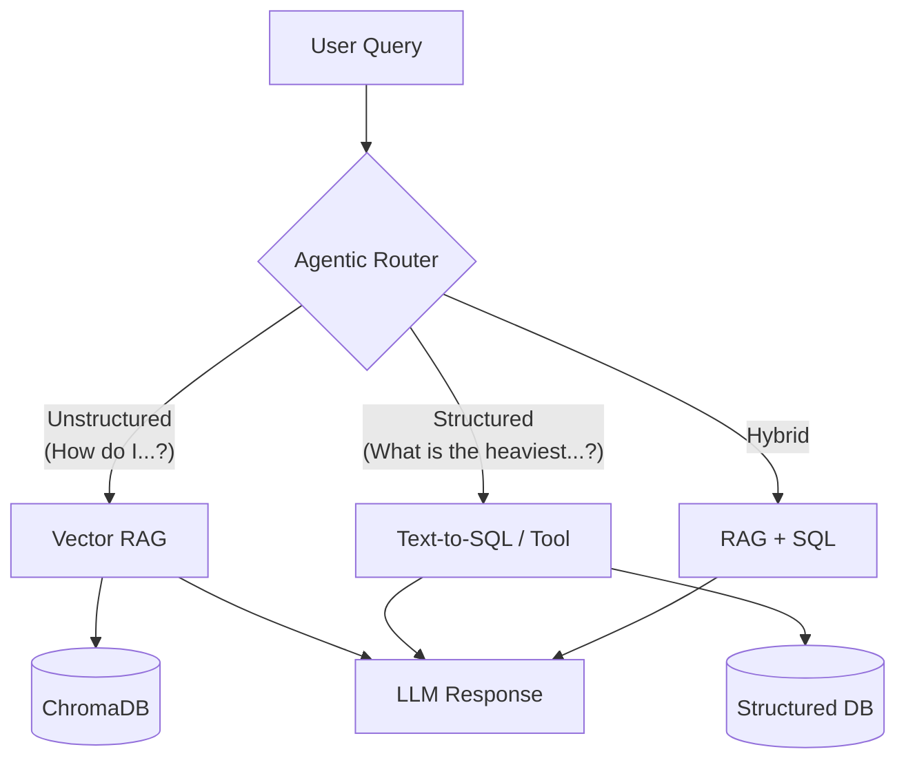
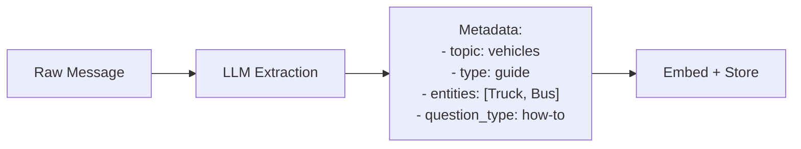
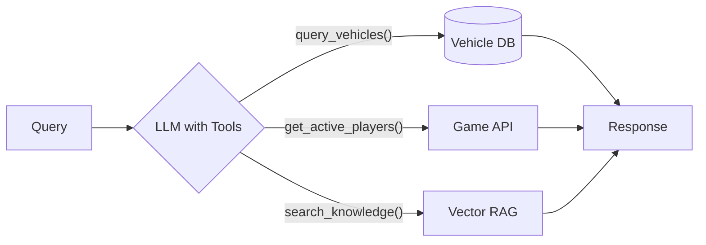
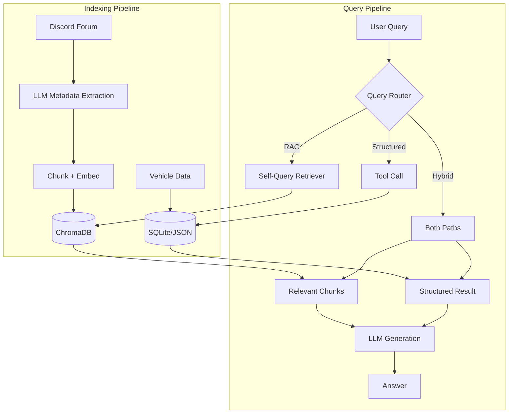

# Knowledge Base Architecture Optimization

> **Status**: Planned  
> **Created**: 2026-01-01  
> **Author**: AI Assistant

## Problem Statement

The current [`knowledge_cog.py`](../amc_peripheral/bot/knowledge_cog.py) implementation is highly inefficient:

1. **Full Context Loading**: On startup and every message update, the bot fetches ALL threads and messages from the Discord Forum channel
2. **Concatenation**: All content is concatenated into a single `knowledge_system_message` string
3. **System Prompt Injection**: This entire blob is injected into every LLM call

### Token Usage Analysis

| Metric | Current Estimate |
|--------|------------------|
| Forum threads | ~20-50 threads |
| Total knowledge tokens | **~25,000-250,000 tokens per call** |
| Daily token waste | **~1.25M-50M tokens** |

> [!CAUTION]
> This approach has **O(n)** cost growth where every new forum message increases every AI call's cost permanently.

---

## Recommended Architecture: Agentic Hybrid RAG

Based on 2025 best practices, I recommend a **hybrid architecture** combining:
1. **Vector RAG** for unstructured knowledge (forum threads, guides)
2. **Structured data tools** for quantitative queries (vehicle stats, player data)
3. **Agentic query routing** to select the right retrieval strategy



---

## Part 1: Advanced RAG with Metadata Enrichment

### The Metadata Problem

Raw Discord messages lack structure. Without metadata, RAG retrieval suffers from:
- **Low precision**: Can't filter by topic, date, or thread
- **Semantic collapse**: Similar embeddings for distinct content
- **Missing context**: Chunk loses parent thread meaning

### Solution: LLM-Assisted Metadata Enrichment

During indexing, use an LLM to extract structured metadata from each chunk:



#### Metadata Schema

```python
class ChunkMetadata(TypedDict):
    thread_id: str
    thread_name: str
    timestamp: str
    # LLM-extracted fields:
    topic: Literal["vehicles", "rules", "radio", "events", "general"]
    content_type: Literal["guide", "faq", "announcement", "discussion"]
    entities: list[str]  # Vehicle names, player names, locations
    question_types: list[str]  # "how-to", "what-is", "comparison", etc.
```

#### Self-Query Retriever

Use a **self-query retriever** pattern: LLM analyzes the user query to extract filter conditions:

```
Query: "What's the fastest truck?"
→ LLM extracts: {topic: "vehicles", entities: ["truck"], question_type: "comparison"}
→ Vector search WITH metadata filter: topic="vehicles" AND "truck" in entities
```

This dramatically improves precision by reducing the search space.

---

## Part 2: Structured Data for Quantitative Queries

### The Problem

Some queries require **exact data retrieval**, not semantic search:
- "What is the heaviest vehicle?"
- "How many players are online?"
- "What's the speed of the Kamaz truck?"

RAG alone fails here because:
- **Semantic collapse**: All "vehicle weight" entries have similar embeddings
- **No aggregation**: Can't compute MAX, MIN, comparisons
- **Stale data**: Real-time data (online players) can't be pre-indexed

### Solution: Tool Calling with Structured Data

Add LLM **function/tool calling** to query structured data sources:



#### Proposed Tools

| Tool | Use Case | Data Source |
|------|----------|-------------|
| `search_knowledge(query)` | General knowledge lookup | ChromaDB (RAG) |
| `query_vehicles(filter, sort, limit)` | Vehicle stats queries | JSON/SQLite |
| `get_active_players()` | Online player count | Game API |
| `get_upcoming_events()` | Event schedule | Discord Events API |
| `get_current_song()` | Radio info | Already exists |

#### Vehicle Data Structure

Create a structured vehicle database (SQLite or JSON):

```python
# vehicles.json or SQLite table
{
    "kamaz_truck": {
        "name": "Kamaz Truck",
        "category": "truck",
        "weight_kg": 8500,
        "top_speed_kmh": 120,
        "fuel_capacity_l": 350
    },
    ...
}
```

Then define a tool:

```python
{
    "name": "query_vehicles",
    "description": "Query vehicle statistics. Use for questions about weight, speed, fuel, etc.",
    "parameters": {
        "filter": {"type": "object", "description": "Filter conditions, e.g. {category: 'truck'}"},
        "sort_by": {"type": "string", "description": "Field to sort by"},
        "sort_order": {"type": "string", "enum": ["asc", "desc"]},
        "limit": {"type": "integer", "default": 5}
    }
}
```

Query: "What's the heaviest vehicle?"
→ LLM calls: `query_vehicles(sort_by="weight_kg", sort_order="desc", limit=1)`
→ Returns: `{"name": "Kamaz Truck", "weight_kg": 8500}`

---

## Part 3: Agentic Query Router

### Why Routing?

Different queries need different strategies:
- "How do I tune the radio?" → **RAG** (semantic search)
- "What's the heaviest truck?" → **SQL/Tool** (structured query)
- "Compare the Kamaz and Volvo trucks" → **Both** (structured + context)

### Implementation: Intent Classification + Routing

```python
class QueryRouter:
    async def route(self, query: str) -> Literal["rag", "structured", "hybrid"]:
        """Use LLM to classify query intent and route accordingly."""
        response = await self.llm.create(
            messages=[
                {"role": "system", "content": """Classify the query intent:
                - "rag": General knowledge, how-to, rules, guides
                - "structured": Numeric comparisons, stats, rankings, real-time data
                - "hybrid": Needs both context and data
                Respond with just the intent type."""},
                {"role": "user", "content": query}
            ]
        )
        return response.content.strip().lower()
```

For cost efficiency, use a **cheap/fast model** (e.g., `gpt-4o-mini`, `gemini-flash`) for routing.

---

## Updated Architecture



---

## Proposed Changes

### [NEW] `amc_peripheral/services/knowledge_service.py`

```python
class KnowledgeService:
    def __init__(self):
        self.chroma = chromadb.PersistentClient(path=KNOWLEDGE_DB_PATH)
        self.collection = self.chroma.get_or_create_collection(
            "amc_knowledge",
            metadata={"hnsw:space": "cosine"}
        )
        self.vehicle_db = VehicleDatabase()  # SQLite or JSON
    
    async def index_thread(self, thread: discord.Thread):
        """Extract metadata and index thread content."""
        chunks = self._chunk_messages(await thread.history().flatten())
        for chunk in chunks:
            metadata = await self._extract_metadata(chunk)  # LLM call
            embedding = await self._embed(chunk.text)
            self.collection.add(
                ids=[chunk.id],
                embeddings=[embedding],
                metadatas=[metadata],
                documents=[chunk.text]
            )
    
    async def retrieve(self, query: str, top_k: int = 5) -> str:
        """Self-query retrieval with metadata filtering."""
        filters = await self._extract_query_filters(query)  # LLM call
        embedding = await self._embed(query)
        results = self.collection.query(
            query_embeddings=[embedding],
            where=filters,
            n_results=top_k
        )
        return "\n\n".join(results["documents"][0])
    
    async def query_vehicles(self, **kwargs) -> list[dict]:
        """Query structured vehicle database."""
        return self.vehicle_db.query(**kwargs)
```

---

### [NEW] `amc_peripheral/data/vehicles.json`

Curate vehicle data in a structured format:

```json
{
  "vehicles": [
    {"id": "kamaz", "name": "Kamaz Truck", "category": "truck", "weight_kg": 8500, "top_speed_kmh": 120},
    {"id": "volvo_fh", "name": "Volvo FH", "category": "truck", "weight_kg": 7200, "top_speed_kmh": 140}
  ]
}
```

---

### [MODIFY] `knowledge_cog.py`

| Area | Before | After |
|------|--------|-------|
| Init | `self.knowledge_system_message = ""` | `self.knowledge_service = KnowledgeService()` |
| Tools | 2 tools (poll, event) | Add `search_knowledge`, `query_vehicles` |
| `ai_helper` | Inject full knowledge blob | Use router → retrieve relevant context only |

---

### [MODIFY] `settings.py`

```python
# Knowledge service
KNOWLEDGE_DB_PATH = os.getenv("KNOWLEDGE_DB_PATH", "./data/knowledge_db")
KNOWLEDGE_EMBEDDING_MODEL = os.getenv("KNOWLEDGE_EMBEDDING_MODEL", "text-embedding-3-small")
KNOWLEDGE_TOP_K = int(os.getenv("KNOWLEDGE_TOP_K", "5"))
KNOWLEDGE_ROUTER_MODEL = os.getenv("KNOWLEDGE_ROUTER_MODEL", "openai/gpt-4o-mini")
```

---

## Migration Strategy

| Phase | Scope | Effort |
|-------|-------|--------|
| **1. Vector RAG** | Replace full-context with basic ChromaDB RAG | 1-2 days |
| **2. Metadata Enrichment** | Add LLM-powered metadata extraction on indexing | 1 day |
| **3. Structured Tools** | Add vehicle database + query tool | 1 day |
| **4. Query Router** | Implement agentic routing | 0.5 day |

> [!TIP]
> Start with Phase 1 for immediate token savings. Phases 2-4 are incremental improvements.

---

## Cost/Benefit Summary

| Metric | Current | Phase 1 (RAG) | Full Implementation |
|--------|---------|---------------|---------------------|
| Tokens per query | ~100K | ~3K | ~2-5K |
| Token reduction | - | 97% | 95-98% |
| Query accuracy | Medium | Medium-High | High |
| Structured queries | ❌ | ❌ | ✅ |
| Setup effort | None | 1-2 days | 3-5 days |

---

## Open Questions

1. **Vehicle data source**: Do you have existing vehicle stats data, or should we scrape/curate it?

2. **Metadata extraction cost**: Each indexed chunk requires an LLM call for metadata. Options:
   - Use cheap model (`gpt-4o-mini`) → ~$0.01 per 100 chunks
   - Use local model (Ollama) → free but slower
   - Skip metadata enrichment in Phase 1

3. **Persistence**: For production, should we use:
   - ChromaDB with persistent volume (simplest)
   - PostgreSQL + pgvector (more robust, if you already have Postgres)
